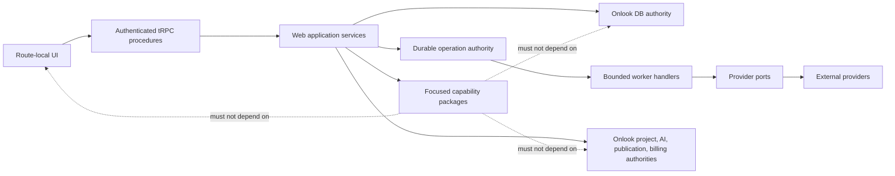
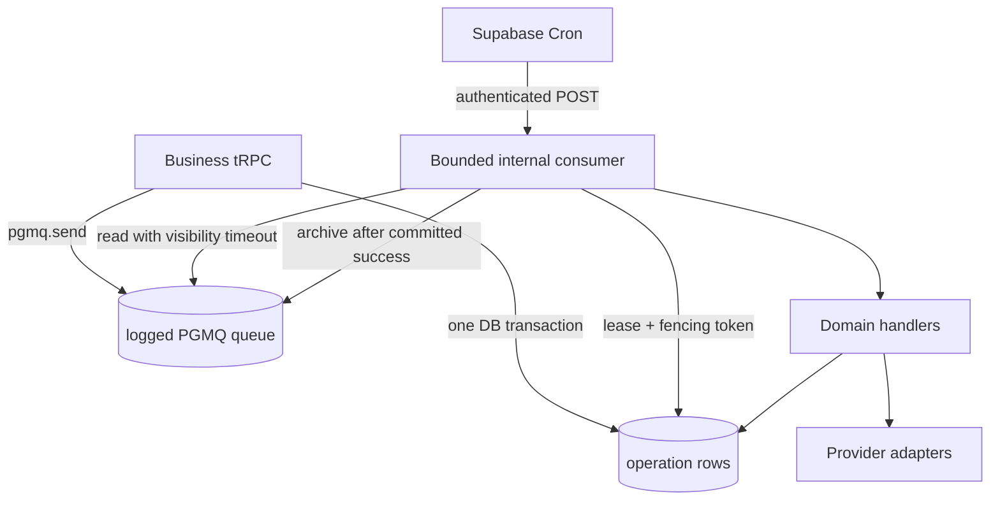

# Architecture Spine — Jagwar Business Workflow Rebuild on Onlook

## Design Paradigm

Jagwar is an **extension-first modular monolith**. User-facing work is a route-local vertical slice in the existing Next.js app. Reusable rules live in narrowly named packages. PostgreSQL is the durable state authority. External vendors sit behind ports and adapters. No Jagwar unit owns an alternative application shell, identity system, project/editor, publishing path, billing ledger, or job platform.



## Invariants & Rules

### AD-1 — Protected-core evolution [ADOPTED]

- **Binds:** all target work
- **Prevents:** a small Jagwar integration silently changing or deprecating Onlook behavior
- **Rule:** Every file present at baseline `423e2e924366419e418ee049093872d535eea41a` is immutable until Andrew approves one Core Change Request for that exact path, purpose, minimal diff, risks, tests, and rollback. New files must follow this spine and cannot be used to bypass a required protected registration or dependency change.

### AD-2 — User ownership, project membership [ADOPTED]

- **Binds:** OD-2; Story 1.1; every Jagwar record and operation
- **Prevents:** a fictitious Workspace authority, browser-chosen tenancy, or accidental project-membership conflation
- **Rule:** For the first release, handoff `ownershipScopeId` maps to the authenticated Supabase `user.id`; every Jagwar business row carries that server-derived owner. Project association and access additionally require current `user_projects` membership. Do not add a Workspace, organization, or membership aggregate. Revisit only when a pinned Onlook baseline supplies a native shared-team authority.

### AD-3 — One persistence and authorization path [ADOPTED]

- **Binds:** OD-3; all persistent business capabilities
- **Prevents:** Neon/donor persistence, client authority, or reliance on incomplete RLS coverage
- **Rule:** Persist additive Jagwar records through `@onlook/db` Drizzle schemas in Supabase PostgreSQL. Authenticate at a protected tRPC or authenticated internal-worker boundary; derive owner from session/worker operation; verify every resource relationship explicitly; add RLS as defense in depth. Direct server Drizzle access never treats RLS as its only authorization check. Every Jagwar parent exposes a unique `(user_id, id)` key and every owned child uses a composite `(user_id, parent_id)` foreign key. Project Links additionally bind `(user_id, project_id)` to the existing `user_projects` membership key or an equivalently atomic database constraint. Repositories require `userId` in every owned read/update predicate; background handlers derive it from the claimed operation and use a restricted worker database role.

### AD-4 — Focused module ownership

- **Binds:** OD-13; all packages and vertical slices
- **Prevents:** a generic Jagwar dumping package, cross-package private imports, circular ownership, and donor-shaped layering
- **Rule:** `@onlook/leads` owns Candidate/discovery/qualification contracts and pure rules; `@onlook/business-policy` owns the release envelope and closed policy-kind contract; `@onlook/durable-operation` owns only operation/attempt/idempotency state machines; `@onlook/outreach` owns connector/compliance/send contracts; `@onlook/activation` owns projection rules; and `@onlook/business-migration` owns offline donor-import contracts and a dry-run-first CLI. These packages may depend on runtime-validation and utility libraries, never React, tRPC, database clients, editor stores, Stripe, provider SDKs, or secrets. UI, application orchestration, provider adapters, and persistence remain in exact capability-named web modules; there is no generic `server/services` directory.

### AD-5 — Closed, versioned policy releases

- **Binds:** Story 1.3; qualification, outreach, activation, and retention policy
- **Prevents:** hard-coded browser policy, unversioned drift, and arbitrary runtime authority
- **Rule:** Each capability publishes its versioned policy schema; `@onlook/business-policy` owns the immutable release envelope, closed `PolicyKind`, validator registry, canonical serializer, and payload-hash function. The web policy service selects the exact public validator before activation and persists actor, schema version, canonical payload hash, effective time, safe diff, and supersession; `(kind, schema_version, payload_hash)` is unique. Every admitted operation snapshots the exact `policyReleaseId` and evaluated aggregate/input version. No release may contain secrets, executable code, SQL, or unvalidated provider payloads.

### AD-6 — One durable execution substrate

- **Binds:** OD-11; Stories 1.4, 2.2, and all outreach dispatch
- **Prevents:** detached route promises, browser workers, duplicate job systems, and unrecoverable external work
- **Rule:** Use a logged Supabase Queue (PGMQ) as the only durable transport. Supabase Cron (`pg_cron`) invokes one authenticated, bounded Next.js internal consumer through `pg_net`; the credential is stored in Supabase Vault and a matching deployment secret. The request is signed over timestamp, nonce, and body; the consumer rejects stale timestamps and atomically records nonces to prevent replay. The queue is not exposed through the Data API. A restricted worker database role receives only the selected function/table privileges needed to claim allowlisted operation kinds and update owned rows. The consumer synchronously claims and processes a fixed maximum batch under fixed concurrency and wall-clock budgets below the verified deployment timeout, then returns; it must not use `waitUntil`, an in-memory queue, or post-response work. PGMQ delivery is at-least-once; the durable `operation` row is source of truth, and the queue transports only `{ operationId, kind, payloadVersion, traceId }`. Exact extension versions, Vault/HTTP support, route runtime/provider/region, authentication rotation, batch, concurrency, visibility, lease, and timeout values are Story 1.4 preflight outputs and block activation until proven.

### AD-7 — Leased, idempotent external effects

- **Binds:** discovery, project creation, outreach, usage settlement, callbacks
- **Prevents:** duplicate provider cost, duplicate projects/sends, false cancellation, and ambiguous crash recovery
- **Rule:** Admission writes the operation and `pgmq.send` in one PostgreSQL transaction. `(user_id, kind, idempotency_key)` is unique and stores a canonical input hash: the same hash returns the original operation, while a different hash is a conflict. Operation states are closed: `queued | leased | dispatching | reconciling | succeeded | failed | canceled | dead_letter`; attempt states are `leased | dispatching | unknown_outcome | succeeded | failed | abandoned`. Claiming is one database transaction: `pgmq.read` plus compare-and-set to `leased` with a new fence and lease. Terminal writes require the active fence; the message is archived only after terminal commit. A redelivery for an already-terminal operation only archives the message. Attempts use bounded backoff and an attempt ceiling. Every provider must support a stable operation-derived idempotency key or a documented reconciliation lookup; otherwise it is ineligible. An ambiguous post-dispatch outcome enters `reconciling`/`unknown_outcome` and cannot be dispatched again until resolved. Cancellation may commit only before the dispatch-start marker. Signed callbacks are first verified and persisted in a unique durable inbox, then applied through this same operation substrate; callbacks never mutate aggregates directly.

### AD-8 — Verified Lead facts remain distinct from guidance

- **Binds:** Epic 2; all generation and outreach inputs
- **Prevents:** vendor payload leakage, fabricated facts, and generated copy becoming evidence
- **Rule:** `@onlook/leads` owns the sole canonical Zod domain contract and explicit persistence mappers for `CandidateV1`; mapper round-trip tests are mandatory. Each fact is either `{ state: 'verified', value, provenanceRefs, observedAt }` or `{ state: 'unknown' }`; provider failure is evidence, not an unknown fact value. Persist only validated normalized evidence (`provider`, stable source reference, content hash, observed time, extraction version), never raw provider payloads, credentials, or secrets. Dedupe-key version, qualification evidence/policy, and deterministic ranking are validated before persistence. Corrections append a new fact revision with supersession lineage; generated guidance cannot alter a verified fact.

### AD-9 — Native project creation with additive business context

- **Binds:** OD-12; Stories 4.1–4.4; AI core
- **Prevents:** a second Site/project document, a new AI context registry, prompt-core drift, and generic starter acceptance
- **Rule:** A Project Link stores only Lead-to-Onlook project identity and lifecycle and requires `user_projects` access. `@onlook/leads/project-context` owns validated `JagwarBusinessContextV1`: Lead ID, selected verified fact revision IDs and provenance, explicit unknowns, qualification-evidence references, brand details, rights-cleared asset references, voice/design direction, and generated guidance as distinct fields. It is read-only context with no save, apply, publish, auth, billing, entitlement, or send authority. Its versioned canonical renderer quotes external text as untrusted data, rejects oversized input rather than truncating it, and produces one bounded existing `CreateRequestContextType.PROMPT`; context version/hash, selected revisions, and rendered prompt hash are retained as generation evidence. The protected `project.ts` extraction in the Core Change Request table is blocking and must delegate the existing canonical project transaction—the prospect path may not reimplement it. The native `project_create_requests` → `useStartProject` → `ChatType.CREATE` path performs generation. Do not add a `MessageContextType` or modify AI prompts, agents, tools, registries, streams, managers, modes, or source-apply behavior. Mark the link active only after native completion and objective evidence shows the editable source/preview contains the exact business name and selected facts and omits unknown labels/claims.

### AD-10 — Immutable send-time publication reference

- **Binds:** Story 4.5; all outreach
- **Prevents:** sending a private, stale, mutable, or wrong project URL
- **Rule:** A Publication Reference points to an authorized completed Onlook deployment and snapshots its deployment ID, type, exact public URL, immutable artifact/version identity, published time, and observation time. If the native authority cannot prove exact output through a version reference or immutable artifact digest/reference, that deployment is ineligible for send. The reference does not replace deployments or domain records; past sends retain it after republish. Authorization, completion, exact identity, and public availability are revalidated immediately before dispatch.

### AD-10A — One compliant send aggregate

- **Binds:** OD-6; Stories 5.1–5.5; 5+2+1 proof
- **Prevents:** ambiguous fan-out, stale consent, suppression races, wrong publication, and duplicate external sends
- **Rule:** Each Send binds exactly one owner, Lead, Project Link, Publication Reference, recipient/channel, connector, message/template version, policy release, and idempotency key; batch selection fans out independent Sends. All consent/suppression mutations and dispatch use the same recipient-channel dispatch lock protocol. Immediately before the provider call, the worker holds that lock, re-reads authoritative consent evidence, suppression, recipient, connector, exact Publication Reference availability, message/template, entitlement, and policy release, records their versions plus the dispatch-start fence, and keeps the lock through the bounded provider call or unknown-outcome transition. Any failed check prevents the provider call and releases reservations. Consent evidence must have been created by the product workflow; provider callbacks follow AD-7.

### AD-11 — One commercial authority, observational costs

- **Binds:** OD-10; Epic 6; billing sequence
- **Prevents:** a second subscription/allowance/usage truth and premature pricing enforcement
- **Rule:** Existing Onlook `products`, `prices`, `subscriptions`, `rate_limits`, `usage_records`, `@onlook/stripe`, and verified Stripe webhooks remain the only customer commercial authority. A physically separate `cost_observation` table and single write API under the durable-operation schema record provider, action, unit, quantity, estimate/actual phase, cost, outcome, retry lineage, latency/concurrency, and trace correlation. `(operation_id, provider, action, unit, phase, attempt_no)` is unique; an actual observation supersedes its estimate in reporting rather than double-counting it. This path never writes `usage_records` and cannot grant entitlement, debit allowance, charge, create checkout, or gate customers. Jagwar commercial enforcement remains blocked until OD-14 and Andrew's approval.

### AD-12 — Server-authoritative consistency contract

- **Binds:** every mutation and projection
- **Prevents:** cross-owner composition, lost updates, duplicate outcomes, unsafe error leakage, and timestamp drift
- **Rule:** Each operation carries session-derived owner, opaque server ID, stable idempotency key, trace ID, aggregate ID/version, UTC timestamp, and closed safe error code. Same-owner relationships are enforced in schema and application code. Immutable evidence is append-only; mutable aggregates use expected-version or equivalent atomic guards. Activation is a table-derived projection rebuilt from committed qualifying Leads, active Project Links with personalized-draft evidence, and successful compliant Sends; events may invalidate/rebuild it but are not its source of truth. It never collapses failure to zero. Whether acceptance or delivery counts toward activation remains the OD-7 release blocker.

### AD-13 — Thin Onlook-native UI

- **Binds:** all Jagwar routes and navigation
- **Prevents:** a second dashboard shell and client-side business authority
- **Rule:** New commercial routes live under one protected `app/(commercial)` route group, default to Server Components, colocate private UI/hooks/tests, compose public `@onlook/ui` primitives/tokens/icons, and use `next-intl` messages. They reuse the current public authentication/subscription boundary and do not create a second shell or customer gate. Client state requests operations and renders durable projections; it never decides owner, consent, suppression, compliance, project access, entitlement, usage, or send eligibility. All flows meet WCAG 2.2 AA: complete keyboard equivalents, visible focus, semantic labels/status announcements, reduced-motion support, preserved responsive behavior, and no color-only state. Navigation into protected original UI requires its own approved Core Change Request.

### AD-14 — Preserve the operational envelope [ADOPTED]

- **Binds:** environments, infrastructure, providers, release
- **Prevents:** an infrastructure rewrite or production side effect hiding inside the workflow rebuild
- **Rule:** Keep the existing Next.js application deployment, Supabase, CodeSandbox, Freestyle, publishing, and custom-domain topology. Initial execution uses deterministic fakes or explicitly approved non-production providers. Production send, billing mutation, deployment, customer-data cutover, destructive migration, or provider/infrastructure replacement requires a separate approved runbook.

### AD-15 — Baseline proof and explicit fork divergence are release inputs

- **Binds:** Story 1.5 and release certification
- **Prevents:** declaring Jagwar complete while an Onlook app or capability is missing or regressed
- **Rule:** Each change names affected baseline capabilities and runs their focused regression plus the applicable declared-target matrix. OD-15 is resolved by Andrew-approved CCR-019 through CCR-022: Jagwar intentionally retires the unavailable private upstream `apps/admin` gitlink, its root script, and its lock records, and does not claim parity with that application. The remaining accessible Onlook capabilities still require preservation and regression proof. Andrew resolved OD-13's operator role and placement on 2026-07-29 through `OD-13-OPERATOR-AUTHORITY.md`: a guarded `/operator` route in the existing web app, fresh Supabase-ID-backed server membership, append-only audit history, and no `adminProcedure` authority. Story 1.3 runtime policy mutation and Epic 7 operator controls reuse the existing identity, billing, project-access, operation, policy, credential, and audit authorities. Exact protected-file CCRs remain mandatory. Non-production fixtures may seed immutable policy releases for the discovery slice but confer no production operator authority. Upstream synchronization must retain or explicitly revisit the recorded admin-removal divergence.

### AD-16 — Offline, auditable donor migration

- **Binds:** donor-use rule; later migration/cutover stories
- **Prevents:** donor architecture becoming runtime compatibility code, silent partial imports, and external effects during migration
- **Rule:** `@onlook/business-migration` is an offline-only package/CLI and never a dependency of the running web app. Every input is first classified as concept reuse, bounded adaptation, target-native replacement, evidence only, or investigate. Imports default to dry-run, consume immutable exports, validate the same public domain contracts, emit source-to-target ID maps, checksums, counts, rejected rows, and resumable checkpoints, and write owner-scoped chunks transactionally with stable idempotency keys. They cannot dispatch providers, publish, mutate billing, or cut over customers. A production import/cutover requires a separate approved runbook, backup, reconciliation, and rollback proof.

## Consistency Conventions

| Concern | Convention |
| --- | --- |
| Naming | Current product-facing/product-specific name is `Jagwar`; use capability names internally; legacy donor name appears only in inventoried provenance. |
| Ownership | Column and operation field is `userId`/`user_id`; `ownershipScopeId` is conceptual handoff vocabulary only. |
| IDs and time | UUIDs are opaque server identities; timestamps are timezone-aware UTC; provider IDs are evidence, never primary authority. |
| Contracts | Zod-validated versioned DTOs at browser/provider/persistence boundaries; fact state uses the explicit AD-8 verified/unknown union, never overloaded null/absence. |
| Errors | Closed safe codes with `retriable` and optional retry-after; raw database/provider errors remain server-side under trace ID. |
| Imports | Public workspace entry points only; route-private modules do not become cross-feature libraries. |
| Secrets | Server environment or approved vault references only; never queue payloads, domain rows, browser state, logs, or telemetry. |
| Events | Stable event ID, owner, aggregate/version, occurred-at, actor/origin, trace ID; events signal committed authority and never duplicate it. |

## Stack

| Name | Version |
| --- | --- |
| Bun | `1.3.1` |
| Next.js | `16.0.7` |
| React | `19.2.0` |
| tRPC | `11.6.0` (locked) |
| Drizzle ORM | `0.44.7` (locked) |
| Zod | `4.1.12` (locked) |
| Supabase CLI | `2.53.6` (locked) |
| Supabase JS | `2.76.1` (locked) |
| CodeSandbox SDK | `1.1.6` (locked) |
| AI SDK | `5.0.26` web / `5.0.60` packages |
| Stripe SDK | `18.5.0` (locked) |
| Freestyle Sandboxes | `0.0.78` |
| PGMQ | target-provided version must be pinned by preflight; upstream current `1.11.1` |
| pg_cron | target-provided version must be pinned by preflight; upstream current `1.6.7` |
| pg_net | target-provided version must be pinned by preflight; required by Cron-to-HTTP design |
| Supabase Vault | target-provided availability/configuration must be proven by preflight |

## Structural Seed

```text
packages/
  leads/                 # Candidate, discovery, qualification contracts/rules/ports
  business-policy/       # policy release envelope and closed policy kinds
  durable-operation/     # operation, attempt, lease, cancellation state machines
  outreach/              # connector, compliance, and send contracts/rules
  activation/            # 5+2+1 projection rules
  business-migration/    # offline dry-run/import contracts; no runtime dependency
  db/src/schema/
    leads/               # searches, runs, snapshots, Leads, qualification, links
    business-policy/     # immutable policy releases
    durable-operation/   # operations, attempts, cost observations
    outreach/            # consent, suppression, connectors, publications, sends
    activation/          # rebuildable projection state where persisted
apps/
  web/client/src/
    app/(commercial)/leads/    # route-local Find Leads and saved-run UI
    app/(commercial)/pipeline/ # route-local CRM UI
    app/(commercial)/outreach/ # route-local connection/send/history UI
    app/api/internal/operations/route.ts # authenticated bounded queue consumer
    server/api/routers/business/          # thin transport composition
    server/services/leads/                # exact capability orchestration/adapters
    server/services/business-policy/
    server/services/durable-operation/
    server/services/outreach/
    server/services/activation/
    server/services/prospect-project/
  backend/supabase/migrations/            # additive schema, RLS, PGMQ, Cron SQL
```



### Protected seams requiring one Core Change Request each

No path below is approved for editing by this spine.

| Protected path | Smallest anticipated purpose |
| --- | --- |
| `packages/db/src/schema/index.ts` | Export new additive schema groups. |
| `packages/db/package.json` | Declare focused capability-package dependencies used by schema enums/types, if required. |
| `apps/web/client/src/server/api/routers/index.ts` | Export one new business router aggregate. |
| `apps/web/client/src/server/api/root.ts` | Register one additive `business` router key. |
| `apps/web/client/package.json` | Declare new focused workspace-package dependencies. |
| `bun.lock` | Maintainer-generated frozen resolution after approved manifest changes. |
| `apps/web/client/src/env.ts` | Validate one server-only internal-consumer authentication secret. |
| `apps/web/client/.env.example` | Document the non-production worker secret without a value. |
| `apps/web/client/src/utils/constants/index.ts` | Add route constants for approved Jagwar destinations. |
| `apps/web/client/src/app/projects/_components/top-bar.tsx` | Add minimal native entry to the commercial workflow. |
| `apps/web/client/messages/en.json` | Add approved user-facing messages. |
| `apps/web/client/messages/es.json` | Add approved user-facing messages. |
| `apps/web/client/messages/ja.json` | Add approved user-facing messages. |
| `apps/web/client/messages/ko.json` | Add approved user-facing messages. |
| `apps/web/client/messages/zh.json` | Add approved user-facing messages. |
| `apps/web/client/messages/en.d.json.ts` | Maintainer-controlled regeneration only; never hand-edit. |
| `apps/web/client/src/server/api/routers/project/project.ts` | Derive project owner from `ctx.user.id` and delegate the canonical project-record transaction to a new additive service reusable by the prospect flow. |

The existing `packages/models/src/project/create.ts`, `project_create_requests`, `use-start-project.tsx`, `ChatType.CREATE`, and AI core need no change for `JagwarBusinessContextV1` prompt composition.

## Capability → Architecture Map

| Capability / Area | Lives in | Governed by |
| --- | --- | --- |
| Identity/ownership | Supabase Auth + user-owned business rows | AD-2, AD-3 |
| Project collaboration | Existing `user_projects` and access verifiers | AD-2, AD-9 |
| Candidate/discovery/qualification | `@onlook/leads`, business router/services, additive DB schemas | AD-4, AD-8 |
| Versioned policy | `@onlook/business-policy`, policy service, policy releases | AD-5 |
| Durable work | `@onlook/durable-operation`, operation tables, PGMQ, Cron, internal consumer | AD-6, AD-7 |
| Pipeline/Lead detail | route-local `app/pipeline`, leads service/schema | AD-2, AD-12, AD-13 |
| Prospect project | Project Link + existing Onlook project creation/editor | AD-9 |
| AI business facts | `JagwarBusinessContextV1` + existing PROMPT creation seam | AD-8, AD-9 |
| Publication | Existing deployments/domains + immutable Publication Reference | AD-10 |
| Outreach | `@onlook/outreach`, durable handlers, route-local UI | AD-6, AD-7, AD-10 |
| Activation | `@onlook/activation` table-derived from committed Leads/Links/Sends | AD-12 |
| Donor migration | offline `@onlook/business-migration` CLI | AD-16 |
| Billing/usage | Existing Onlook Stripe/subscription/rate-limit/usage authority | AD-11 |
| Cost telemetry | operation-linked non-enforcing cost observations | AD-11, AD-12 |
| UI/design | `@onlook/ui`, `next-intl`, route-local composition | AD-13 |

## Deferred

- Interactive discovery provider (OD-4), weak-site policy V1 (OD-5), WhatsApp/BSP and legal basis (OD-6), activation acceptance-versus-delivery rule (OD-7), and retention policy (OD-9) remain gates for their named stories; their authority boundaries are fixed here. Raw provider payload retention is excluded from the initial release; later retention requires a policy, legal basis, access controls, and deletion proof.
- Jagwar prices, plans, checkout products, allowances, top-ups/overages, trial gates, and customer-facing enforcement remain blocked by representative cost evidence and Andrew's OD-14 approval.
- CodeSandbox, Freestyle, hosting, and custom-domain replacement remain later infrastructure work.
- Shared team/agency ownership remains deferred until Onlook supplies a pinned native team authority.

## Open Questions and Blocking Preconditions

1. Preserve the approved OD-15 target divergence and frozen-install regression. Jagwar does not ship the inaccessible private upstream admin; the approved OD-13 `/operator` surface remains inside the existing web app and separately gated by exact protected-file CCRs.
2. Before Story 1.4, start the approved pinned Supabase target and record the PostgreSQL build plus `pgmq`, `pg_cron`, and `pg_net` availability/exact versions; prove Vault credential retrieval, Cron-to-HTTPS reachability, queue isolation from the Data API, the restricted worker role, signed-request rotation/replay defense, and observability. Supabase documents Queues availability on PostgreSQL `15.6.1.143+`. Also record the actual Next route runtime/provider/region and measured duration ceiling, then select fixed batch, concurrency, visibility, lease, retry, and request-timeout budgets. If any required facility is unavailable, amend AD-6 before implementation; do not add another queue or detached worker.
3. Before Stories 4.2+, execute Story 4.1 with a deterministic fixture and prove the native PROMPT seam creates an authorized editable draft containing the exact business name and selected facts, omitting unknowns. Code tracing alone is not completion evidence.
4. OD-13 role, placement, UI/service seams, protected-path map, and regression boundary are resolved by `OD-13-OPERATOR-AUTHORITY.md`. Runtime implementation must still obtain exact protected-file CCRs and may not infer authority from `adminProcedure` or create a parallel auth, billing, project, job, or audit system.
5. Resolve OD-7 before claiming the 5+2+1 release: the activation projection requires one explicitly approved successful-Send predicate (provider acceptance or delivery), while either choice must also satisfy AD-10A consent/compliance evidence.
